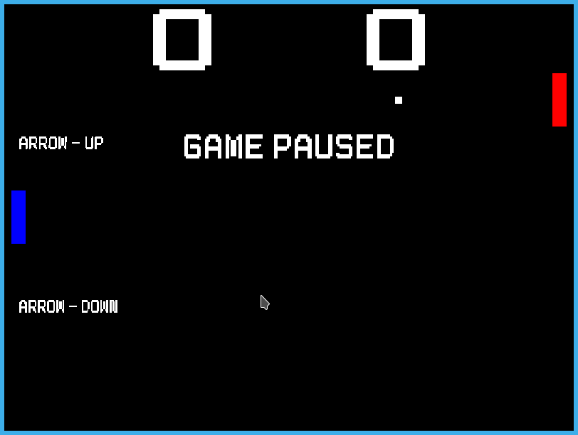

# SDL2 Pong

A [Pong] game written in **C** using [SDL2].



## Dependencies

This game is being develop on a [Debian 11] environment.

* libsdl2-dev
* libsdl2-gfx-dev
* libsdl2-image-dev
* libsdl2-mixer-dev
* libsdl2-ttf-dev

## Build

To build the game run:

```sh
$ make all
```

## Running

To run the game:

```sh
$ bin/game
$ # or
$ make run
```

## Developer

|  |
|:---------------------------------------------------------:|
| [Edimar Calebe Castanho (Calebe94)](https://github.com/Calebe94) |

# License

All software is covered under [GNU General Public License v3.0](https://www.gnu.org/licenses/gpl-3.0.en.html).

[Pong]: https://en.wikipedia.org/wiki/Pong
[SDL2]: https://www.libsdl.org/index.php
[Debian 11]: https://www.debian.org/News/2022/20220326
